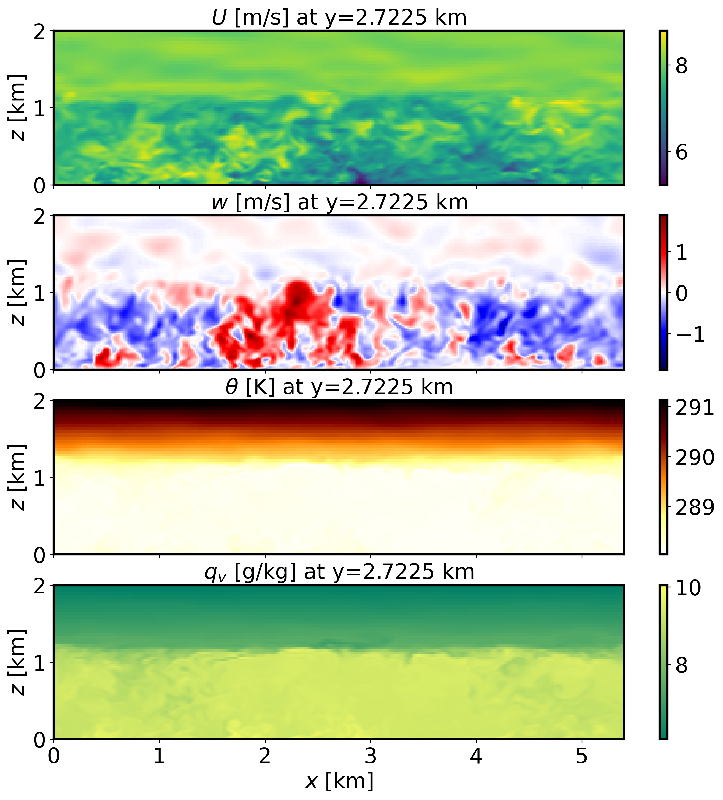

=======================
Offshore boundary layer
=======================

Background
----------

This is an offshore boundary layer scenario at the location of the FINO1 platform in the North Sea. The case is similar to that described in Munoz-Esparza et al. (2014a). This tutorial cases introduces the use of an offshore roughness length formulation. Additional surface forcings arise from a temperature warming rate and a static skin water vapor content that is larger than initial atmospheric condition at the ground by :math:`4` g/kg.

Input parameters
----------------

* Number of grid points: :math:`[N_x,N_y,N_z]=[360,362,90]`
* Isotropic grid spacings in the horizontal directions: :math:`[dx,dy]=[15,15]` m, vertical grid is :math:`dz=15` m at the surface and stretched with verticalDeformFactor :math:`=0.50`
* Domain size: :math:`[5.40 \times 5.43 \times 2.70]` km
* Model time step: :math:`0.04` s
* Advection scheme: 5th-order upwind
* Time scheme: 3rd-order Runge Kutta
* Geostrophic wind: :math:`[U_g,V_g]=[8.1,0]` m/s
* Latitude: :math:`54.0145^{\circ}` N
* Surface potential temperature: :math:`288` K
* Potential temperature profile:

.. math::
  \partial{\theta}/\partial z =
    \begin{cases}
      0 & \text{if $z$ $\le$ 925 m}\\
      0.003 & \text{if $z$ > 925 m}
    \end{cases} 

* Surface warming rate:  :math:`0.5` K/h
* Surface roughness length: Donelan (1990) parameterization
* Rayleigh damping layer: uppermost :math:`400` m of the domain
* Initial perturbations: :math:`\pm 0.50` K 
* Depth of perturbations: :math:`825` m
* Top boundary condition: free slip
* Lateral boundary conditions: periodic
* Time period: :math:`4` h

Execute FastEddy
----------------

Note that this example requires customization of the initial condition file. A Jupyer notebook is provided in /tutorial/notebooks/Offshore_Prep.ipynb that asigns the SeaMask 2d array to 1.0 (required to activate the offshore parameterization), imposes a linear profile initial condition for water vapor mixing ratio and an initial time-invariant skin water vapor mixing ratio content. In addition, the initial condition for dry hydrostatic desnity is readjusted to account for the presence of water vapor. Run FastEddy using the input parameters file /tutorials/examples/Example06_OFFSHORE.in first for 1 timestep to create the FE_OFFSHORE.0 file, and then run the Jupyter notebook to modify the initial condition as described. Then, run FastEddy for the :math:`4` h of the simulation. To execute FastEddy, follow the instructions `here`_.

.. _here: https://github.com/NCAR/FastEddy-model/blob/main_v2.0/README.md

Visualize the output
--------------------

Open the Jupyter notebook entitled "MAKE_FE_TUTORIAL_PLOTS.ipynb" and execute it using setting: case = 'offshore'.

XY-plane views of instantaneous horizontal wind, vertical velocity, potential temperature and water vapor mixing ratio at :math:`t=4` h (FE_OFFSHORE.360000):

.. image:: ../images/UVWTHETA-XY-offshore.png
  :width: 1200
  :alt: Alternative text
  
XZ-plane views of instantaneous horizontal wind, vertical velocity, potential temperature and water vapor mixing ratio at :math:`t=4` h (FE_OFFSHORE.360000):

  
Mean (domain horizontal average) vertical profiles of state variables at :math:`t=7` h (FE_OFFSHORE.360000):

.. image:: ../images/MEAN-PROF-offshore.png
  :width: 750
  :alt: Alternative text

Probability distributions of roghness length for momentum and heat at :math:`t=4` h (FE_OFFSHORE.360000):

.. image:: ../images/PDF-offshore.png
  :width: 750
  :alt: Alternative text
 
Horizontally-averaged vertical profiles of turbulence quantities at :math:`t=3-4` h [perturbations are computed at each time instance from horizontal-slab means, then averaged horitontally and over the previous 1-hour mean]:

.. image:: ../images/TURB-PROF-offshore.png
  :width: 1200
  :alt: Alternative text 

Analyze the output
------------------

* How do the surface roughness lengths in this offshore environemnt compare in terms of magnitude and spatial distribution to the neutral ABL tutorial case?
* What is the impact of offshore roughness length of momentum on mechanical turbulence production compared to typical conditions over land?
* Using the vertical profile plots, explain the ABL stratification and what surface forcings are contributing to create buoyancy effects and of which magnitude and sign?
