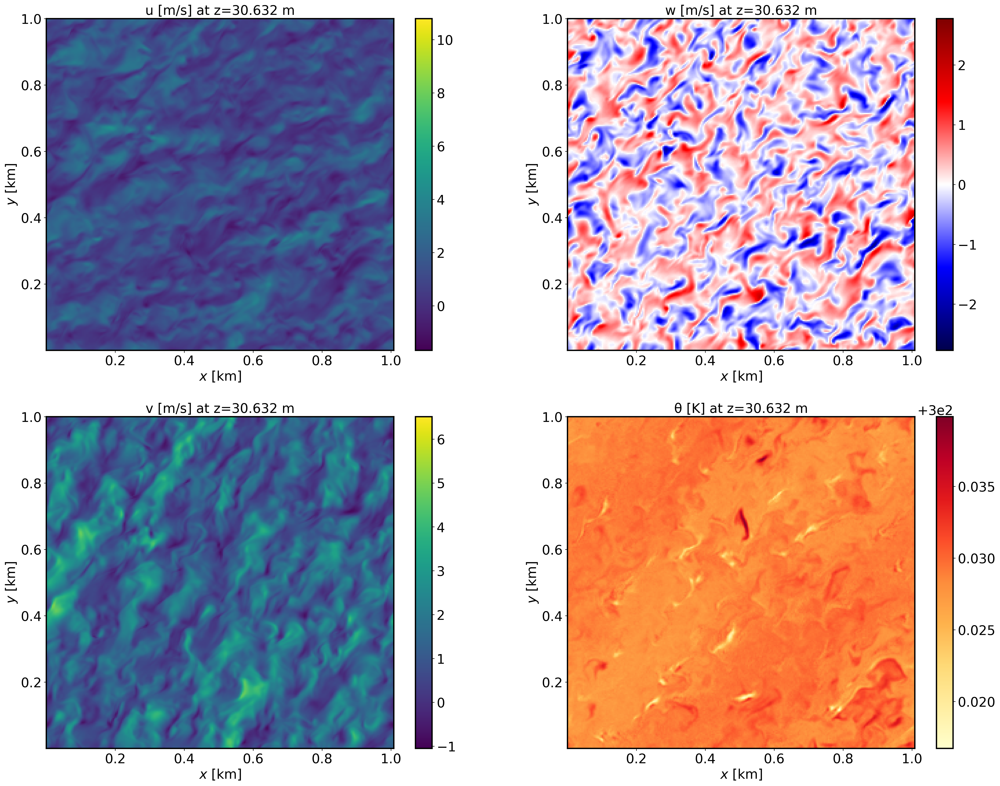
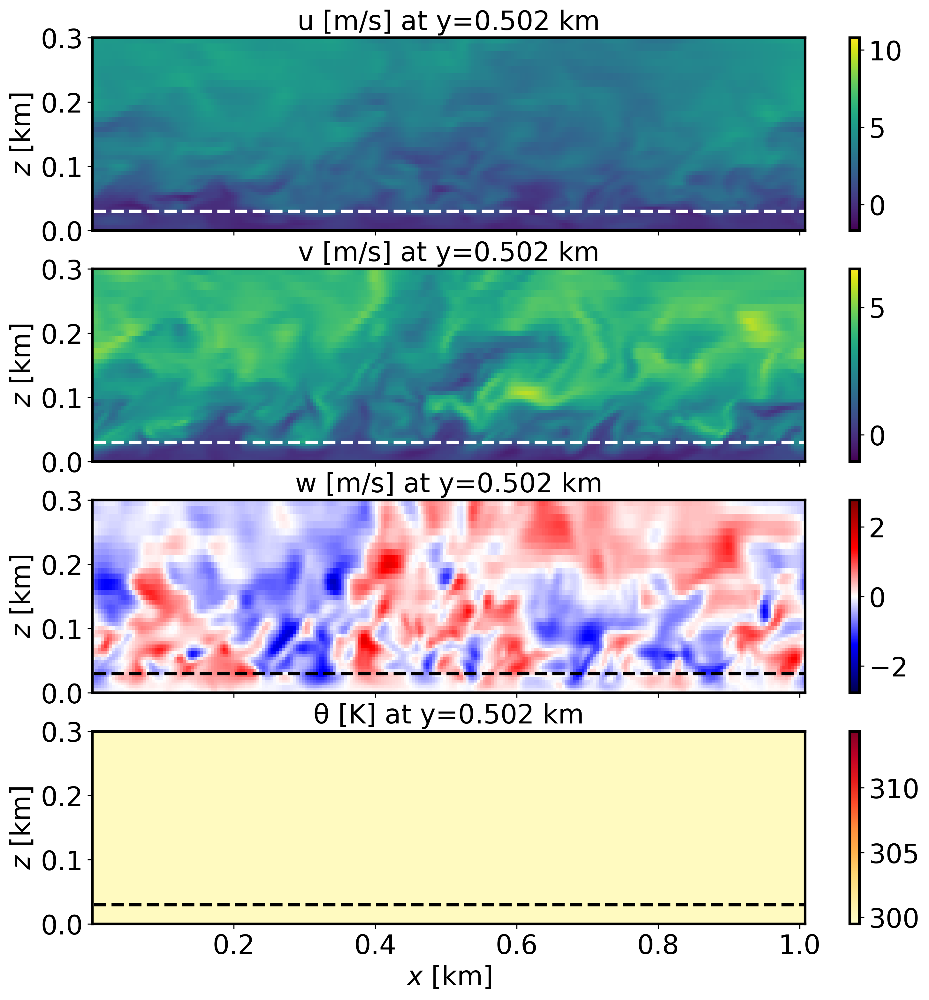

=================================================
Canopy inclusive boundary layer
=================================================

Background
----------

This is an idealized scenario of a neutrally stratified boundary layer in the presence of a horizontally homogeneous canopy. This case utilizes a two-equation canopy model (Shaw and Scumann, 1992; Shaw and Patton, 2003).

Input parameters
----------------

* Number of grid points: :math:`[N_x,N_y,N_z]=[252,250,90]`
* Isotropic grid spacings in the horizontal directions: :math:`[\Delta x,\Delta y]=[4,4]` m, vertical grid is :math:`\Delta z=4` m at the surface and stretched with verticalDeformFactor :math:`=0.25`
* Domain size: :math:`[1.0 \times 1.0 \times 1.44]` km
* Model time step: :math:`0.01` s
* Advection scheme: 5th-order upwind
* Time scheme: 3rd-order Runge Kutta
* Geostrophic wind: :math:`[U_g,V_g]=[10,0]` m/s
* Latitude: :math:`54.0^{\circ}` N
* Surface potential temperature: :math:`300` K
* Potential temperature profile:

.. math::
  \partial{\theta}/\partial z =
    \begin{cases}
      0 & \text{if $z$ $\le$ 500 m}\\
      0.08 & \text{if 500 m < $z$ $\le$ 650 m}\\
      0.003 & \text{if $z$ > 650 m}
    \end{cases} 

* Surface heat flux:  :math:`0.0` Km/s
* Surface roughness length: :math:`z_0=1e-12` m
* Rayleigh damping layer: uppermost :math:`600` m of the domain
* Initial perturbations: :math:`\pm 0.25` K 
* Depth of perturbations: :math:`375` m
* Top boundary condition: free slip
* Lateral boundary conditions: periodic
* Time period: :math:`4` h

Execute FastEddy
----------------

Note that this example requires specification of a leaf area density (LAD) profile. A Jupyter notebook is provided in **tutorial/notebooks/Canopy_Prep.ipynb** that reads in an LAD profile in .csv format. The *LAD_profile.csv* file can be obtained at this `Zenodo record <https://zenodo.org/records/12610511>`_. The notebook also uses a FastEddy initial condition file to create a new initial condition file, *FE_CANOPY.0*, that includes de LAD information (CanopyLAD array). The notebook expects a canopy height value to be specified (:math:`h_c`), and that is currently set to 30.0 m. 

1. Create a working directory to run the FastEddy tutorials and change to that directory.
2. Create a **Example05_CANOPY** subdirectory and change to that directory.
3. The FastEddy code will write its output to an **output** subdirectory. Create an **output** directory, if one does not already exist.   
4. Download the *LAD_profile.csv* and place it in an *initial* subdirectory at the same level as the **output** subdirectory.
5. First, run FastEddy using the input parameters file **tutorials/examples/Example05_CANOPY.in** for 1 timestep to create the *FE_CANOPY.0* file.  To run for 1 timestep, the following values need to be changed in the **tutorials/examples/Example05_CANOPY.in** file:

   * Change :code:`frqOutput` from 30000 to 1
   * Change :code:`Nt` from 1440000 to 1
   * Change :code:`NtBatch` from 30000 to 1

6. After running for 1 timestep, run the Jupyter notebook *Canopy_Prep.ipynb* file modifying the CanopyLAD array to include the LAD profile instead of the initialized all zeros. Modify `path_base` in this notebook file, specifying the path to the **initial/** directory that contains the *LAD_profile.csv* file. Be sure to including the trailing slash :code:`/` in :code:`path_base`. Note that this run of the Jupyter notebook will write a *FE_CANOPY.0* in the **initial** subdirectory.
7. Then, run FastEddy for the :math:`4` h of the simulation by changing :code:`frqOutput`, :code:`Nt`, and :code:`NtBatch` back to their original values in **tutorials/examples/Example05_CANOPY.in**, and modify :code:`inPath` and :code:`inFile` in **tutorials/examples/Example05_CANOPY.in**, specifying the path and the filename, respectively, for the newly written initial condition *FE_CANOPY.0* file in the **initial** directory. Be sure to including the	trailing slash :code:`/` in the :code:`inPath`.

See :ref:`run_fasteddy` for instructions on how to build and run FastEddy on NSF NCAR's High Performance Computing machines.

Visualize the output
--------------------

1. Open the Jupyter notebook entitled *MAKE_FE_TUTORIAL_PLOTS.ipynb*.
2. Under the "Define parameters" section, modify :code:`path_base`, specifying the full path to the **Example05_CANOPY** subdirectory, but don't include **Example05_CANOPY** subdirectory. Be sure to include a trailing slash :code:`/`).
3. Under the "Define parameters" section, modify :code:`case` to set its value to :code:`canopy`.
4. Run the Jupyter notebook.
5. The resulting XY cross section png plots will be placed in a **FIGS** subdirectory of the **Example05_CANOPY** directory.

XY-plane views of instantaneous velocity components at :math:`t=4` h (FE_CANOPY.1440000):

  
XZ-plane views of instantaneous velocity components at :math:`t=4` h (FE_CANOPY.1440000):

  
Mean (domain horizontal average) vertical profiles of wind speed at :math:`t=4` h (FE_CANOPY.1440000) and horizontally-averaged vertical profiles of turbulence quantities at :math:`t=3-4` h [perturbations are computed at each time instance from horizontal-slab means, then averaged horitontally and over the previous 1-hour mean]. Note that TKE_0 and TKE_1 correspond to the grid and wake-scale SGS TKE components.

.. image:: ../images/TURB-PROF-canopy.png
  :width: 600
  :alt: Alternative text 

Analyze the output
------------------

* Using the XY and XZ cross sections, discuss the characteristics (scale and magnitude) of the resolved turbulence.
* How does the vertical wind speed profile shape differ from the log-law?
* Using the vertical TKE profiles, discuss how well-resolved are these LES results and the regions where the SGS content of both TKE scales is most relevant.

