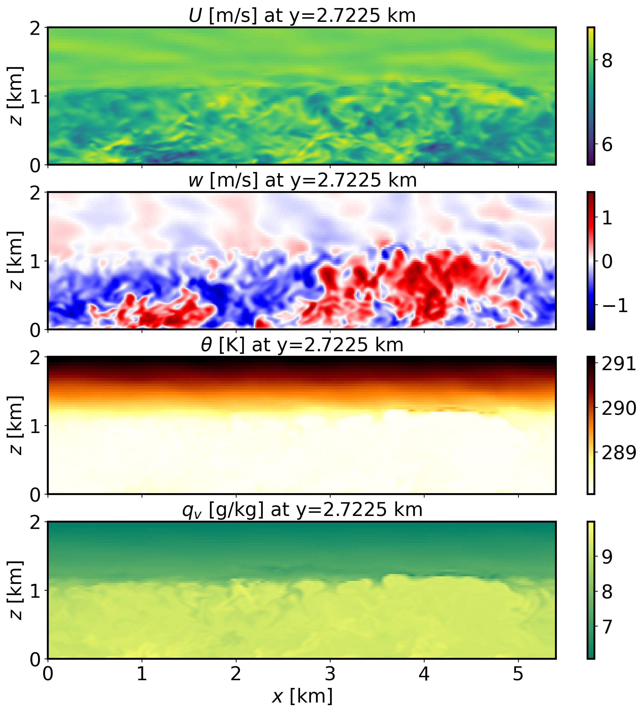
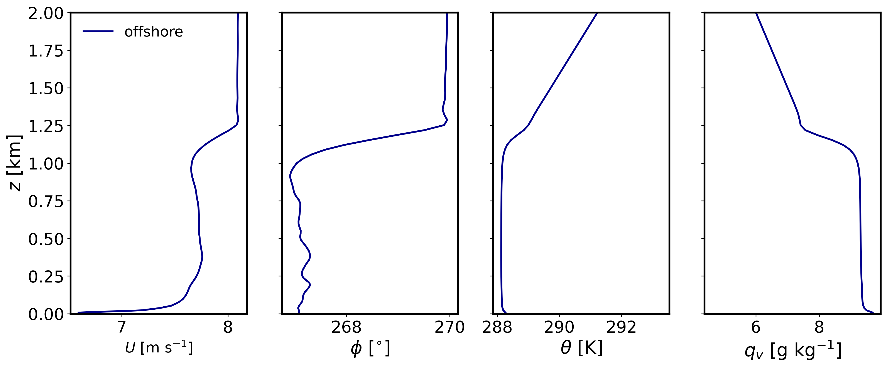
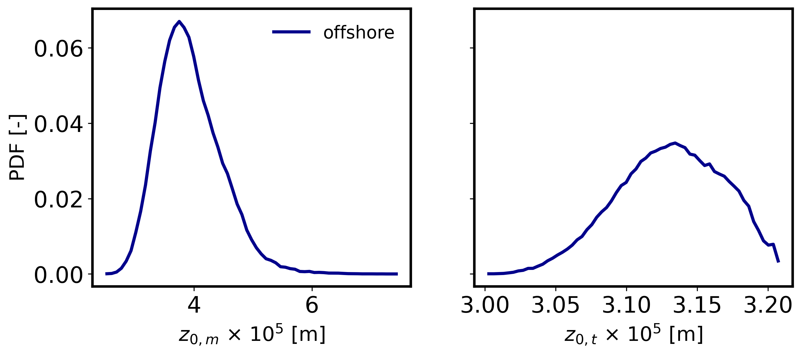
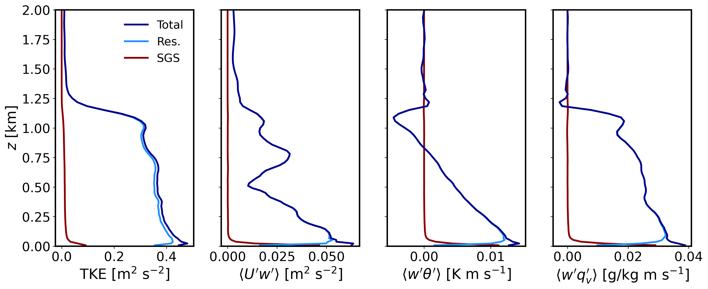

=======================
Offshore boundary layer
=======================

Background
----------

This is an offshore boundary layer scenario at the location of the FINO1 platform in the North Sea. The case is similar to that described in Munoz-Esparza et al. (2014a). This tutorial cases introduces the use of an offshore roughness length formulation. Additional surface forcings arise from a temperature warming rate and a static skin water vapor content that is larger than initial atmospheric condition at the ground by :math:`4` g/kg.

Input parameters
----------------

* Number of grid points: :math:`[N_x,N_y,N_z]=[360,362,90]`
* Isotropic grid spacings in the horizontal directions: :math:`[\Delta x,\Delta y]=[15,15]` m, vertical grid is :math:`\Delta z=15` m at the surface and stretched with verticalDeformFactor :math:`=0.50`
* Domain size: :math:`[5.40 \times 5.43 \times 2.70]` km
* Model time step: :math:`0.04` s
* Advection scheme: 5th-order upwind
* Time scheme: 3rd-order Runge Kutta
* Geostrophic wind: :math:`[U_g,V_g]=[8.1,0]` m/s
* Latitude: :math:`54.0145^{\circ}` N
* Surface potential temperature: :math:`288` K
* Potential temperature profile:

.. math::
  \partial{\theta}/\partial z =
    \begin{cases}
      0 & \text{if $z$ $\le$ 925 m}\\
      0.003 & \text{if $z$ > 925 m}
    \end{cases} 

* Surface warming rate:  :math:`0.5` K/h
* Surface roughness length: Drennan (2003) parameterization
* Rayleigh damping layer: uppermost :math:`400` m of the domain
* Initial perturbations: :math:`\pm 0.50` K 
* Depth of perturbations: :math:`825` m
* Top boundary condition: free slip
* Lateral boundary conditions: periodic
* Time period: :math:`4` h

Execute FastEddy
----------------

Note that this example requires customization of the initial condition file. A Jupyter notebook is provided in **tutorial/notebooks/Offshore_Prep.ipynb** that assigns the SeaMask 2d array to 1.0 (required to activate the offshore parameterization), imposes a linear profile initial condition for water vapor mixing ratio and an initial time-invariant skin water vapor mixing ratio content. In addition, the initial condition for dry hydrostatic desnity is readjusted to account for the presence of water vapor.

1. Create a working directory to run the FastEddy tutorials and change to that directory.
2. Create a **Example06_OFFSHORE** subdirectory and change to that directory.
3. The FastEddy code will write its output to an **output** subdirectory. Create an **output** directory, if one does not already exist.   
4. Run FastEddy using the input parameters file **tutorials/examples/Example06_OFFSHORE.in** first for 1 timestep to create the *FE_OFFSHORE.0* file.  To run for 1 timestep, the following values need to be changed in the **tutorials/examples/Example06_OFFSHORE.in** file:

  * Change :code:`frqOutput` from 7500 to 1
  * Change :code:`Nt` from 360000 to 1
  * Change :code:`NtBatch` from 7500 to 1

5. The run of the Jupyter notebook in the next step will write a *FE_OFFSHORE.0* file in an **initial** subdirectory. Create an **initial** directory, if one does not already exist.
6. Then, run the Jupyter notebook to produce a modified initial conditions file as describe in the first paragraph. Modify :code:`path_base` in the **tutorial/notebooks/Canopy_Prep.ipynb** file, specifying the path to the **Example06_OFFSHORE** directory. Be sure to include the trailing slash :code:`/`.
7. Then, run FastEddy for the :math:`4` h of the simulation by changing :code:`frqOutput`, :code:`Nt`, and :code:`NtBatch` back to their original values, and modify :code:`inPath` and :code:`inFile` in tutorials/example/Example06_OFFSHORE.in, specifying the path and the filename, respectively, for the newly written initial condition *FE_OFFSHORE.0* file in the initial directory.  Be sure to include the trailing slash :code:`/` in the :code:`inPath`.

See :ref:`run_fasteddy` for instructions on how to build and run FastEddy on NSF NCAR's High Performance Computing machines.

Visualize the output
--------------------

1. Open the Jupyter notebook entitled *MAKE_FE_TUTORIAL_PLOTS.ipynb*.
2. Under the "Define parameters" section, modify :code:`path_base`, specifying the full path to the **Example06_OFFSHORE** subdirectory, but don't include **Example06_OFFSHORE** subdirectory. Be sure to include a trailing slash :code:`/`).
3. Under the "Define parameters" section, modify :code:`case` to set its value to :code:`offshore`.
4. Run the Jupyter notebook.
5. The resulting XY cross section png plots will be placed in a **FIGS** subdirectory of the **Example06_OFFSHORE** directory.

XY-plane views of instantaneous horizontal wind, vertical velocity, potential temperature and water vapor mixing ratio at :math:`t=4` h (FE_OFFSHORE.360000):

.. image:: ../images/UVWTHETA-XY-offshore.png
  :width: 1200
  :alt: Alternative text
  
XZ-plane views of instantaneous horizontal wind, vertical velocity, potential temperature and water vapor mixing ratio at :math:`t=4` h (FE_OFFSHORE.360000):

  
Mean (domain horizontal average) vertical profiles of state variables at :math:`t=7` h (FE_OFFSHORE.360000):

Probability distributions of roghness length for momentum and heat at :math:`t=4` h (FE_OFFSHORE.360000):

 
Horizontally-averaged vertical profiles of turbulence quantities at :math:`t=3-4` h [perturbations are computed at each time instance from horizontal-slab means, then averaged horitontally and over the previous 1-hour mean]:

Analyze the output
------------------

* How do the surface roughness lengths in this offshore environemnt compare in terms of magnitude and spatial distribution to the neutral ABL tutorial case?
* What is the impact of offshore roughness length of momentum on mechanical turbulence production compared to typical conditions over land?
* Using the vertical profile plots, explain the ABL stratification and what surface forcings are contributing to create buoyancy effects and of which magnitude and sign?
